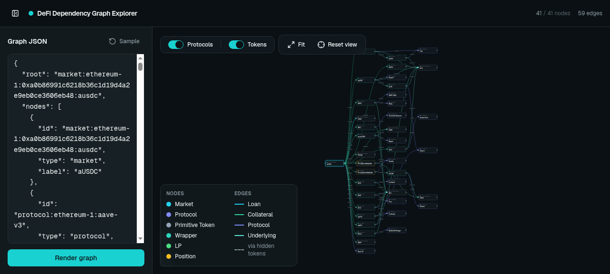

# Token Dependencies Viewer

Next.js app for visualizing token and market dependency graphs.

The app lets you paste a dependency graph JSON payload, render it as an interactive graph, hide protocol or token-like nodes, and inspect incoming and outgoing edges for each node.



## Installation

```bash
yarn install
```

## Usage

Start the local development server from the repository root:

```bash
yarn start
```

Then open:

```text
http://localhost:3000
```

The app starts with a sample graph. Paste a new graph JSON payload into the left panel and click **Render graph**.

## Graph Format

The input must be a JSON object with:

- `root`: id of the root node
- `nodes`: list of graph nodes
- `edges`: list of directed edges

Example:

```json
{
  "root": "market:ethereum-1:ausdc",
  "nodes": [
    {
      "id": "market:ethereum-1:ausdc",
      "type": "market",
      "label": "aUSDC"
    },
    {
      "id": "protocol:ethereum-1:aave-v3",
      "type": "protocol",
      "label": "Aave V3"
    },
    {
      "id": "primitive-token:ethereum-1:usdc",
      "type": "primitive_token",
      "label": "USDC"
    }
  ],
  "edges": [
    {
      "from": "market:ethereum-1:ausdc",
      "to": "protocol:ethereum-1:aave-v3",
      "type": "protocol"
    },
    {
      "from": "market:ethereum-1:ausdc",
      "to": "primitive-token:ethereum-1:usdc",
      "type": "loan"
    }
  ]
}
```

### Node Types

- `market`
- `protocol`
- `primitive_token`
- `wrapper`
- `lp`
- `position`

### Edge Types

- `loan`
- `collateral`
- `protocol`
- `underlying`

## Controls

- Toggle **Protocols** to show or hide protocol nodes.
- Toggle **Tokens** to show or hide token-like nodes.
- Use **Fit** to fit the visible graph in the viewport.
- Use **Reset view** to center the root node.
- Click any node to open the details panel.

When hidden token-like nodes are collapsed, the viewer connects the nearest visible nodes with a dashed edge labeled `via hidden tokens`.

## Scripts

```bash
yarn start
yarn lint
yarn build
```

## Deploying to Vercel

This is a standard Next.js app inside a workspace.

Recommended project settings:

```text
Root Directory: packages/app
Framework Preset: Next.js
Install Command: yarn install --frozen-lockfile
Build Command: yarn build
Output Directory: default
```

## Notes

- The app does not require environment variables.
- The graph is rendered client-side with React Flow.
- Layout is computed with Dagre.
- The sample graph is defined in `lib/sample-graph.ts`.
